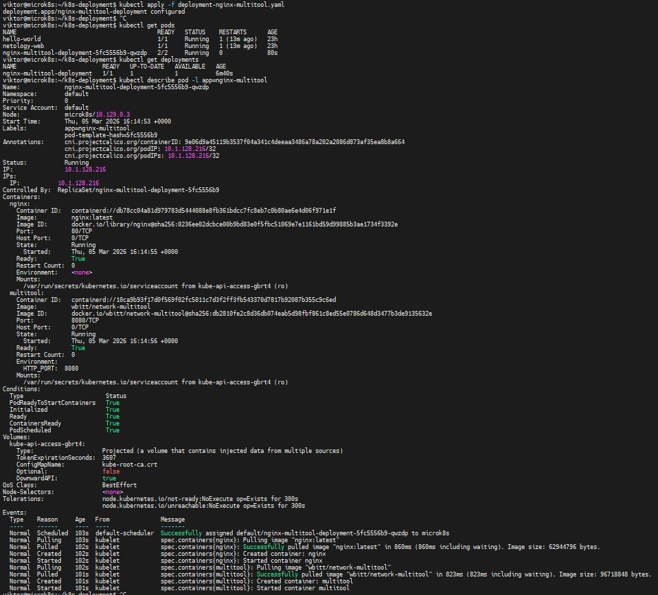
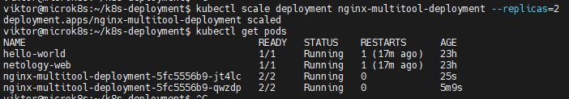
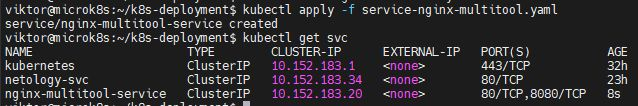
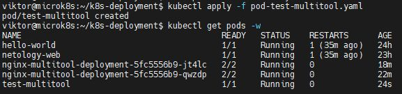
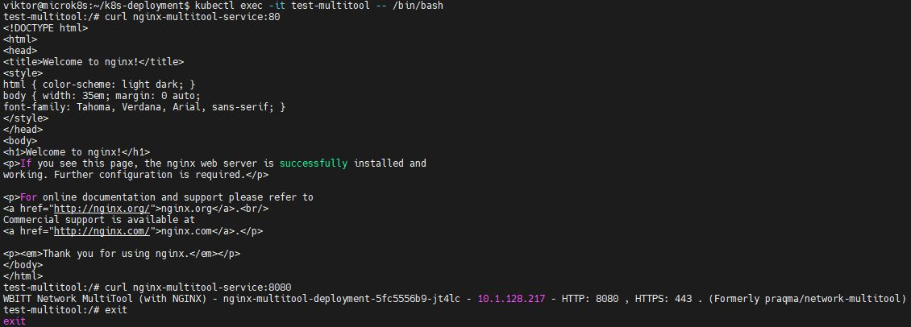
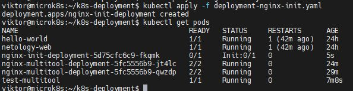
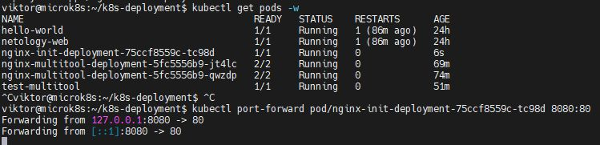
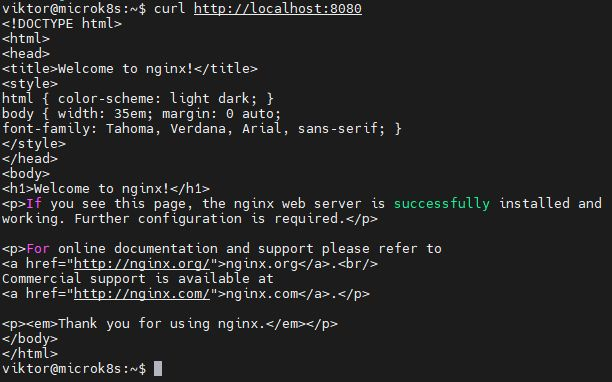

# Домашнее задание к занятию «Запуск приложений в K8S» - Лебедев В.В. FOPS-33

### Цель задания

В тестовой среде для работы с Kubernetes, установленной в предыдущем ДЗ, необходимо развернуть Deployment с приложением, состоящим из нескольких контейнеров, и масштабировать его.

------

### Чеклист готовности к домашнему заданию

1. Установленное k8s-решение (например, MicroK8S).
2. Установленный локальный kubectl.
3. Редактор YAML-файлов с подключённым git-репозиторием.

------

### Инструменты и дополнительные материалы, которые пригодятся для выполнения задания

1. [Описание](https://kubernetes.io/docs/concepts/workloads/controllers/deployment/) Deployment и примеры манифестов.
2. [Описание](https://kubernetes.io/docs/concepts/workloads/pods/init-containers/) Init-контейнеров.
3. [Описание](https://github.com/wbitt/Network-MultiTool) Multitool.

------

### Задание 1. Создать Deployment и обеспечить доступ к репликам приложения из другого Pod

1. Создать Deployment приложения, состоящего из двух контейнеров — nginx и multitool. Решить возникшую ошибку.
2. После запуска увеличить количество реплик работающего приложения до 2.
3. Продемонстрировать количество подов до и после масштабирования.
4. Создать Service, который обеспечит доступ до реплик приложений из п.1.
5. Создать отдельный Pod с приложением multitool и убедиться с помощью `curl`, что из пода есть доступ до приложений из п.1.

### Решение 1

 Создадим Deployment с двумя контейнерами

deployment-nginx-multitool.yaml до

```yaml
apiVersion: apps/v1
kind: Deployment
metadata:
  name: nginx-multitool-deployment
  labels:
    app: nginx-multitool
spec:
  replicas: 1
  selector:
    matchLabels:
      app: nginx-multitool
  template:
    metadata:
      labels:
        app: nginx-multitool
    spec:
      containers:
      - name: nginx
        image: nginx:latest
        ports:
        - containerPort: 80
      - name: multitool
        image: wbitt/network-multitool
        ports:
        - containerPort: 80
        env:
        - name: HTTP_PORT
          value: "80"
```

```shell
kubectl apply -f deployment-nginx-multitool.yaml
Warning: spec.template.spec.containers[1].ports[0]: duplicate port definition with spec.template.spec.containers[0].ports[0]
deployment.apps/nginx-multitool-deployment created
```

Возникла ошибка, потому что оба контейнера пытаются использовать один и тот же порт 80

[deployment-nginx-multitool.yaml](https://github.com/ViktorLebedev93/k8s-1.3-hw/blob/main/deployment-nginx-multitool.yaml) после исправления (изменили порт)
```yaml
apiVersion: apps/v1
kind: Deployment
metadata:
  name: nginx-multitool-deployment
  labels:
    app: nginx-multitool
spec:
  replicas: 1
  selector:
    matchLabels:
      app: nginx-multitool
  template:
    metadata:
      labels:
        app: nginx-multitool
    spec:
      containers:
      - name: nginx
        image: nginx:latest
        ports:
        - containerPort: 80
      - name: multitool
        image: wbitt/network-multitool
        ports:
        - containerPort: 8080
        env:
        - name: HTTP_PORT
          value: "8080"
```

Ошибка ушла

```shell
kubectl apply -f deployment-nginx-multitool.yaml
deployment.apps/nginx-multitool-deployment configured
kubectl get pods
NAME                                         READY   STATUS    RESTARTS      AGE
hello-world                                  1/1     Running   1 (13m ago)   23h
netology-web                                 1/1     Running   1 (13m ago)   23h
nginx-multitool-deployment-5fc5556b9-qwzdp   2/2     Running   0             80s
kubectl get deployments
NAME                         READY   UP-TO-DATE   AVAILABLE   AGE
nginx-multitool-deployment   1/1     1            1           6m40s
```



Масштабируем до 2 реплик

```shell
kubectl scale deployment nginx-multitool-deployment --replicas=2
deployment.apps/nginx-multitool-deployment scaled
kubectl get pods
NAME                                         READY   STATUS    RESTARTS      AGE
hello-world                                  1/1     Running   1 (17m ago)   23h
netology-web                                 1/1     Running   1 (17m ago)   23h
nginx-multitool-deployment-5fc5556b9-jt4lc   2/2     Running   0             25s
nginx-multitool-deployment-5fc5556b9-qwzdp   2/2     Running   0             5m9s
```



Создаем Service для доступа к репликам

[service-nginx-multitool.yaml](https://github.com/ViktorLebedev93/k8s-1.3-hw/blob/main/service-nginx-multitool.yaml)
```yaml
apiVersion: v1
kind: Service
metadata:
  name: nginx-multitool-service
spec:
  selector:
    app: nginx-multitool
  ports:
  - name: nginx-port
    protocol: TCP
    port: 80
    targetPort: 80
  - name: multitool-port
    protocol: TCP
    port: 8080
    targetPort: 8080
  type: ClusterIP
```

```shell
kubectl apply -f service-nginx-multitool.yaml
service/nginx-multitool-service created
kubectl get svc
NAME                      TYPE        CLUSTER-IP      EXTERNAL-IP   PORT(S)           AGE
kubernetes                ClusterIP   10.152.183.1    <none>        443/TCP           32h
netology-svc              ClusterIP   10.152.183.34   <none>        80/TCP            23h
nginx-multitool-service   ClusterIP   10.152.183.20   <none>        80/TCP,8080/TCP   8s
```



Создаем отдельный Pod с multitool для проверки доступа

[pod-test-multitool.yaml](https://github.com/ViktorLebedev93/k8s-1.3-hw/blob/main/pod-test-multitool.yaml)
```yaml
apiVersion: v1
kind: Pod
metadata:
  name: test-multitool
  labels:
    app: test-multitool
spec:
  containers:
  - name: multitool
    image: wbitt/network-multitool
    env:
    - name: HTTP_PORT
      value: "8080"
    command: ["sleep", "3600"]
```

```shell
kubectl apply -f pod-test-multitool.yaml
pod/test-multitool created
kubectl get pods -w
NAME                                         READY   STATUS    RESTARTS      AGE
hello-world                                  1/1     Running   1 (35m ago)   24h
netology-web                                 1/1     Running   1 (35m ago)   23h
nginx-multitool-deployment-5fc5556b9-jt4lc   2/2     Running   0             18m
nginx-multitool-deployment-5fc5556b9-qwzdp   2/2     Running   0             22m
test-multitool                               1/1     Running   0             24s
```



Проверка доступа из тестового пода



------

### Задание 2. Создать Deployment и обеспечить старт основного контейнера при выполнении условий

1. Создать Deployment приложения nginx и обеспечить старт контейнера только после того, как будет запущен сервис этого приложения.
2. Убедиться, что nginx не стартует. В качестве Init-контейнера взять busybox.
3. Создать и запустить Service. Убедиться, что Init запустился.
4. Продемонстрировать состояние пода до и после запуска сервиса.

### Решение 2

Создадим Deployment с Init-контейнером

[deployment-nginx-init.yaml](https://github.com/ViktorLebedev93/k8s-1.3-hw/blob/main/deployment-nginx-init.yaml)
```yaml
apiVersion: apps/v1
kind: Deployment
metadata:
  name: nginx-init-deployment
  labels:
    app: nginx-init
spec:
  replicas: 1
  selector:
    matchLabels:
      app: nginx-init
  template:
    metadata:
      labels:
        app: nginx-init
    spec:
      initContainers:
      - name: init-check-service
        image: busybox:latest
        command: 
        - sh
        - -c
        - |
          echo "Waiting for service DNS to be resolvable..."
          until nslookup nginx-init-service | grep -q "Address:"; do
            echo "Service DNS not ready, waiting 2 seconds..."
            sleep 2
          done
          echo "Service DNS is ready! Starting nginx..."
      containers:
      - name: nginx
        image: nginx:latest
        ports:
        - containerPort: 80
```

initContainers — выполняется до запуска основного контейнера
Init-контейнер проверяет доступность сервиса nginx-init-service через nslookup
Основной контейнер (nginx) запустится только после успешного завершения init-контейнера

Запускаем Deployment без Service

```shell
kubectl apply -f deployment-nginx-init.yaml
deployment.apps/nginx-init-deployment created
kubectl get pods
NAME                                         READY   STATUS     RESTARTS      AGE
hello-world                                  1/1     Running    1 (42m ago)   24h
netology-web                                 1/1     Running    1 (42m ago)   24h
nginx-init-deployment-5d75cfc6c9-fkqmk       0/1     Init:0/1   0             5s
nginx-multitool-deployment-5fc5556b9-jt4lc   2/2     Running    0             24m
nginx-multitool-deployment-5fc5556b9-qwzdp   2/2     Running    0             29m
test-multitool                               1/1     Running    0             7m8s
```



Init-контейнер в статусе Init:0/1, так как не может найти сервис nginx-init-service

Создадим и запустим Service

[service-nginx-init.yaml](https://github.com/ViktorLebedev93/k8s-1.3-hw/blob/main/service-nginx-init.yaml)
```yaml
apiVersion: v1
kind: Service
metadata:
  name: nginx-init-service
spec:
  selector:
    app: nginx-init
  ports:
  - protocol: TCP
    port: 80
    targetPort: 80
  type: ClusterIP
```

```shell
kubectl apply -f service-nginx-init.yaml
kubectl get svc
NAME                      TYPE        CLUSTER-IP      EXTERNAL-IP   PORT(S)           AGE
kubernetes                ClusterIP   10.152.183.1    <none>        443/TCP           33h
netology-svc              ClusterIP   10.152.183.34   <none>        80/TCP            24h
nginx-init-service        ClusterIP   10.152.183.21   <none>        80/TCP            49m
nginx-multitool-service   ClusterIP   10.152.183.20   <none>        80/TCP,8080/TCP   64m
kubectl delete deployment nginx-init-deployment
kubectl apply -f deployment-nginx-init.yaml
```

Основной контейнер nginx запустился




------

### Правила приема работы

1. Домашняя работа оформляется в своем Git-репозитории в файле README.md. Выполненное домашнее задание пришлите ссылкой на .md-файл в вашем репозитории.
2. Файл README.md должен содержать скриншоты вывода необходимых команд `kubectl` и скриншоты результатов.
3. Репозиторий должен содержать файлы манифестов и ссылки на них в файле README.md.

------